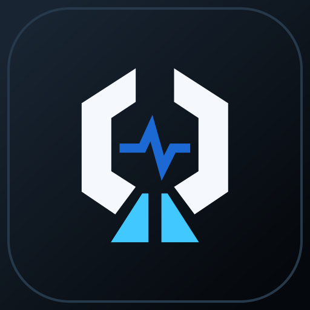
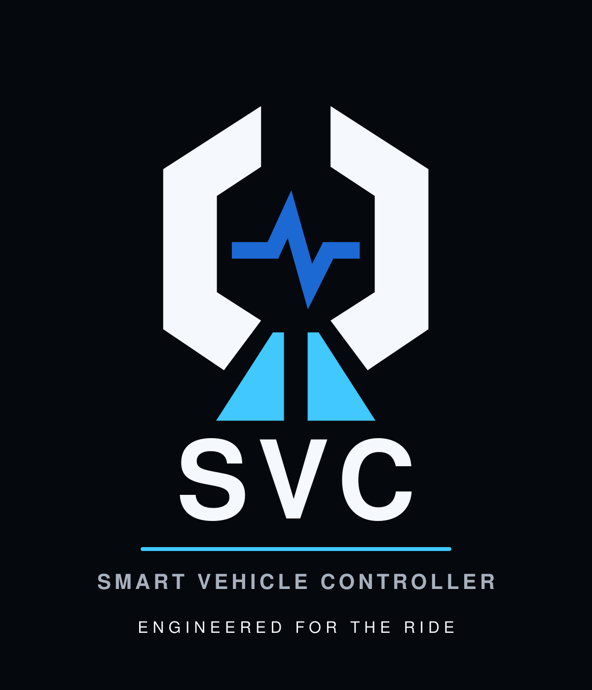

# SVC Platform — Smart Vehicle Controller

<p align="center">
  
</p>

<p align="center">
  Open modular hardware, firmware, and mobile software for controlling
  auxiliary equipment on motorcycles and other vehicles.
</p>

**Reference Vehicle #001:** BMW R1200GS K25 2007<br>
**VIN:** WB10307A97ZU65028

## Mission

SVC should allow new functionality to be added primarily through configuration,
plugins, firmware updates, or Logic Board replacement without redesigning the
Power Board.

## Current status

Architecture v1.0 is frozen. Firmware safety, configuration, role mapping,
rule execution, CAN safety, update policy, and PWM ownership have host-tested
scaffolds.

The three boards are moving through the controlled EVT lifecycle independently:

| Board | Current repository state | Release boundary |
| --- | --- | --- |
| **PB-100** | `EVT-LAYOUT-AUTHORIZED` | Partial layout only; fabrication and production remain blocked |
| **LB-100** | `EVT-FAB-AUTHORIZED` | One segregated five-piece bare-PCB EVT package only |
| **FB-100** | `EVT-LAYOUT-AUTHORIZED` | Layout may continue; fabrication and production remain blocked |

These states describe the current `master` baseline. They do not authorize a
combined board order or production release. Detailed and machine-checked gates
are tracked in
[`docs/product/final-readiness.md`](docs/product/final-readiness.md).

## Mobile application

<p align="center">
  
  &nbsp;&nbsp;&nbsp;&nbsp;
  
</p>

SVC Mobile is being developed for iOS and Android. It provides the foundation
for live telemetry, diagnostics, vehicle data, channel control, event history,
configuration, and phone-mediated firmware updates. CHIGEE AIO-6 is treated as
a CarPlay/Android Auto projection host; the applications run on the phone.

The committed mobile baseline includes SwiftUI and Jetpack Compose
applications, BLE and protocol layers, mock data, projection scaffolds, a
GitHub Releases client, and signed-update validation. Physical channel control,
live BLE integration, and firmware transfer/installation remain disabled or
mock-backed until hardware validation closes the applicable safety gates.

The images above use only the project-owned SVC identity.
Vehicle-manufacturer artwork is not part of this repository presentation.

### SVC Ride Dashboard

<p align="center">
  
</p>

Dashboard v1 is implemented for the SwiftUI and Jetpack Compose phone targets.
It uses separate versioned vehicle-performance profiles, explicit telemetry
quality states, profile-driven tachometer zones, SVC-estimated lean, Day/Night
themes, Reduce Motion, and adaptive landscape/portrait layouts. Missing CAN
signals remain `—`; gear is not inferred from speed and RPM. CarPlay and
Android Auto retain a separate, reduced information-only template.

- [Mobile overview and local build commands](software/mobile/README.md)
- [iOS application](software/mobile/ios/SVCMobile/README.md)
- [Android application](software/mobile/android/README.md)
- [Firmware update trust boundary](docs/architecture/firmware-update.md)
- [SVC identity assets](software/mobile/branding/svc/README.md)
- [Ride Dashboard implementation boundary](software/mobile/docs/ride-dashboard-roadmap.md)

## Validation

```bash
make check
```

This runs repository readiness checks, KiCad validation, firmware configuration
validation and host tests, mobile protocol tests, and release-policy checks.
The same command runs in GitHub Actions on push and pull request.

Platform-specific mobile workflows additionally build and test the Android and
iOS projects in GitHub Actions.

## Repository structure

```text
docs/                 Architecture, ADR, requirements, production docs
hardware/             KiCad and mechanical files
firmware/             Embedded firmware, bootloader, plugins
software/             SVC Studio and SVC Mobile
can-db/               Vehicle CAN databases
production/           BOM, Gerber, Pick&Place, assembly docs
tools/                Readiness, protocol, security, and release validation
```

## Board naming

- **PB-100** — Power Board, intended to remain stable for 10–15 years.
- **LB-100** — Logic Board, replaceable and upgradeable.
- **FB-100** — Front Panel Board, service interface and indicators.

## Hard rule

**Power Board is sacred.**

New features should not require Power Board redesign unless all configuration,
plugin, firmware, and Logic Board options are exhausted.
