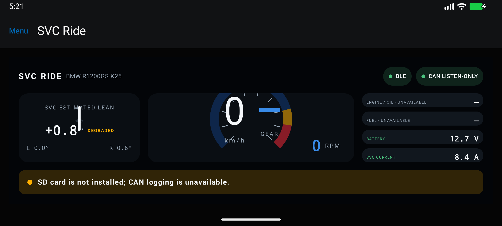

# SVC Mobile

SVC Mobile runs on the phone. CHIGEE AIO-6 is a CarPlay/Android Auto projection
host, not an installation target.

## Layout

```text
protocol/   Versioned JSON and BLE contracts
vehicle-profiles/ Shared technical dashboard profiles
ios/        SwiftUI/CoreBluetooth application scaffold
android/    Kotlin/Compose/Android BLE/Car App scaffold
mock-data/  Hardware-free application data
```

Both phone applications start with `MockDeviceRepository`. No mobile or
projected-display action controls a physical power channel.

Vehicle performance configuration is separate from visual branding. The shared
`vehicle-profiles/vehicle-profile-index-v1.json` catalog contains confirmed
dashboard scales and reference values; unknown values remain explicit `null`.
The Generic Motorcycle fallback intentionally defines no red zone or engine
limits.

## SVC Ride Dashboard v1

The phone targets contain the same adaptive dashboard contract in SwiftUI and
Jetpack Compose. Landscape is primary; portrait rearranges the same information
without changing its meaning. The dashboard provides:

- central speed and explicit gear presentation (`N`, `1`–`6`, `BETWEEN`, `—`);
- profile-driven tachometer scale, warning/red zones, 80 rpm color hysteresis,
  smooth arc motion, and an unsmoothed numeric RPM value;
- SVC-estimated lean angle with left/right trip maxima and stationary-only
  reset;
- engine temperature, fuel, battery voltage, total SVC current, BLE/CAN state,
  and the highest-priority active warning;
- separate `SVC Day`, `SVC Night`, and ambient-light `Automatic` themes with
  configurable 250/650 lux hysteresis defaults;
- system Reduce Motion support and shared 180/300 ms motion tokens.

Every value passes through `valid`, `stale`, `degraded`, `invalid`, or
`unavailable` presentation state. Stale, invalid, and unavailable measurements
render as `—`, never as zero. The current telemetry v1 contract has no gear
measurement, so normal mock operation intentionally renders `GEAR —`. Lean is
marked degraded until mounting calibration exists; calibration remains disabled
outside the future Demo Mode.

<p align="center">
  
</p>

The screenshot contains no vehicle-manufacturer artwork. Full graphics are
phone-only. The experimental CarPlay/Android Auto templates expose only speed,
gear, battery, SVC current, main warning, and connection state and currently
render unavailable values rather than invented telemetry.

## Startup and personal branding

The phone apps load the common profile catalog from
`branding/brand-pack-index-v1.json` and the 2100 ms startup contract from
`branding/startup-animation-v1.json` at runtime. Manufacturer metadata and
artwork resolve from `branding/vehicle-brands/vehicle-brands-v1.json` by stable
`brandId`; `brandId`, `model`, `generation`, and `year` remain separate profile
fields. Brand text, color, asset paths, profile choices, and phase timing are
not duplicated in Swift or Kotlin.

The default personal profile is `bmw-r1200gs-k25-personal` with theme
`svc-boxer-blue`. Its preferred asset is the period-correct
`brands/bmw/bmw-roundel-1997-2020.svg`. Other profiles use
`logo-on-dark.svg` on the standard dark startup surface. Manufacturer
wordmarks are optional and fall back to the catalog display name as text. If a
profile or required logo is unavailable, the apps show the committed SVC mark,
`SMART VEHICLE CONTROLLER`, and `ENGINEERED FOR THE RIDE`. No brand artwork is
downloaded at runtime. Preview the result from
`Settings → Appearance → Preview Startup Animation`.

The public application identity is always SVC. The phone launcher, App
Store/Google Play package, CarPlay, and Android Auto use the committed SVC app
icon sourced from `branding/svc/svg/svc-app-icon.svg` and its platform exports.
Manufacturer assets appear only inside the selected post-launch phone profile
animation. The OS launch surface stays neutral black and never presents BMW
branding.

The vehicle catalog preserves `THIRD_PARTY_NOTICES.md`, its pinned Simple Icons
license/disclaimer, per-brand source URLs, and the original/derived SVG
variants. Run protocol validation after adding a brand; it requires every
catalog entry to contain `brand.json`, `logo-source.svg`, `logo-on-dark.svg`,
`logo-on-light.svg`, and `logo-accent.svg`, and parses every SVG as XML.

Profile/theme loading, mock BLE restoration, telemetry refresh, and screen
restoration start in parallel. The animation never waits for BLE; Dashboard
shows `Connecting to SVC` until restoration completes. Critical warnings use a
500 ms startup and render as a red card after it. Reduced motion also uses a
500 ms fade, while disabled animation enters the selected screen immediately.
No POST statuses or fabricated `OK` values appear in startup.

The animation is phone-only. CarPlay and Android Auto retain host-controlled
launch transitions and show only the SVC app identity, profile name, permitted
accent, and informational templates.

Future Dashboard Demo Mode, telemetry protocol v2, real BLE telemetry, and
verified BMW K25 CAN signals are intentionally separate changes. See
[`docs/ride-dashboard-roadmap.md`](docs/ride-dashboard-roadmap.md).

## GitHub Releases client

The iOS and Android data layers include an unauthenticated client for this
public repository. No PAT is stored or sent:

- stable uses `GET /repos/avlyubimov/svc-platform/releases/latest`;
- beta and test load the public release list and select matching prerelease
  tags;
- tags must be `svc-vX.Y.Z`, `svc-vX.Y.Z-beta.N`, or
  `svc-vX.Y.Z-test.N`;
- `firmware-manifest.json`, component assets, and detached signature assets
  are downloaded over HTTPS;
- GitHub asset size/digest, manifest size/SHA-256, detached-signature
  size/SHA-256, key ID, and RSA-PSS/SHA-256 signature are checked before a
  manifest is accepted.

The production public key is injected into each phone build after production
key provisioning; private keys never enter a mobile build. Missing or
unrecognized public-key material fails closed. Installation and BLE firmware
transfer remain mock-only. `review-raw` assets are explicitly non-installable.

## Protocol validation

```bash
python3 -m pip install -r tools/mobile_protocol_validation/requirements.txt
python3 tools/validate_mobile_protocol.py
python3 tools/validate_ota_release.py scaffold
PYTHONPATH=tools python3 -m unittest discover \
  -s tools/mobile_protocol_validation/tests
```

## iOS

Requirements: current Xcode and XcodeGen.

```bash
cd software/mobile/ios/SVCMobile
xcodegen generate
xcodebuild \
  -project SVCMobile.xcodeproj \
  -scheme SVCMobile \
  -sdk iphonesimulator \
  -destination 'platform=iOS Simulator,name=iPhone 16' \
  test
```

The default target has no CarPlay entitlement. See
`ios/SVCMobile/README.md` before enabling the experimental scene.

## Android

Requirements: JDK 21, Android SDK 36, and Gradle 8.11.1.

```bash
gradle -p software/mobile/android \
  :app-mobile:assembleDebug \
  test
```

Install `app-mobile/build/outputs/apk/debug/app-mobile-debug.apk`, enable Android
Auto developer mode and unknown sources, then start Desktop Head Unit according
to Google's DHU instructions. The merged APK contains the experimental IoT
`CarAppService`.

## Mock data

`mock-data/device-v1.json` intentionally marks undecoded CAN values unavailable.
Mock values are development data and are never substituted for missing vehicle
signals on a real connection.
