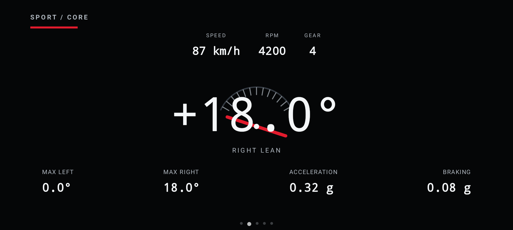

# SVC Mobile

SVC Mobile runs on the phone. CHIGEE AIO-6 is a CarPlay/Android Auto projection
host, not an installation target.

## Layout

```text
protocol/   Versioned JSON and BLE contracts
vehicle-profiles/ Shared technical dashboard profiles
ios/        SwiftUI/CoreBluetooth application scaffold
android/    Kotlin/Compose/Android BLE/Car App scaffold
mock-data/  Hardware-free application data
```

Both phone applications start with `MockDeviceRepository`. No mobile or
projected-display action controls a physical power channel.

Vehicle performance configuration is separate from visual branding. The shared
`vehicle-profiles/vehicle-profile-index-v1.json` catalog contains confirmed
dashboard scales and reference values; unknown values remain explicit `null`.
The Generic Motorcycle fallback intentionally defines no red zone or engine
limits.

## SVC TFT Ride Dashboard

The phone targets contain the same Ride Mode contract in SwiftUI and Jetpack
Compose. Ride Mode is a dedicated landscape-only full-screen container; the
ordinary application navigation remains outside it. While active, it hides
application and system navigation chrome, renders edge-to-edge with cutout-safe
content, keeps the display awake, and restores orientation, system bars,
brightness, and idle-timer behavior on exit.

Ride Mode uses the same non-cyclic swipe order on both platforms:

1. `PURE RIDE`
2. `SPORT / CORE`
3. `VEHICLE`
4. `SVC POWER`
5. `DIAGNOSTICS`

Horizontal swipes animate for 250 ms, vertical movement does not change pages,
and the system gesture edges remain available. The selected page is restored
after a later app launch; a new installation starts on `PURE RIDE`. A small
page indicator fades after three seconds and can be disabled in Settings.
Tapping free space shows a three-second overlay for exit, brightness,
Auto/Day/Night, and Settings; exit and Settings require confirmed zero speed.
The former rectangular card layout is not used in Ride Mode. The primary TFT
provides:

- central speed, a smaller `km/h` unit, an unsmoothed numeric RPM value, and a
  large right-side gear presentation (`N`, `1`–`6`, `BETWEEN`, `—`);
- a flat, segmented 0–9000 RPM tachometer: inactive dark gray, active
  0–7000 white, 7000–8000 amber, and 8000–9000 red;
- compact fuel, range, battery, engine temperature, and time values in one
  five-group lower strip rather than cards;
- active-only pictographic telltales, BLE/CAN only on connection loss or
  Diagnostics, transient SD toast, and a narrow persistent area reserved for
  critical warnings;
- dedicated full-screen pages for Sport/lean telemetry, Vehicle/RDC, SVC
  power, and listen-only CAN diagnostics;
- separate `SVC Day`, `SVC Night`, and ambient-light `Automatic` themes with
  configurable 250/650 lux hysteresis defaults;
- system Reduce Motion support and shared 180/300 ms motion tokens.

Every value passes through `valid`, `stale`, `degraded`, `invalid`, or
`unavailable` presentation state. Stale, invalid, and unavailable measurements
render as `—`, never as zero. The current telemetry v1 contract has no gear
measurement, so normal mock operation intentionally renders `GEAR —`. Lean is
marked degraded until mounting calibration exists; calibration remains disabled
outside the future Demo Mode.

<p align="center">
  
</p>

<p align="center">
  
</p>

The explicit review-only presentation dataset contains 87 km/h, 4200 RPM,
gear 4, 18° right lean, 62% fuel, 14.2 V, 2.3/2.6 bar RDC values, and +16 °C.
It is selected only by test/preview launch flags and never enters the telemetry
wire contract. The 2048×921 review screenshot is captured from the full-screen container and
contains no status bar, navigation bar, Home Indicator, Menu, TabBar, or
vehicle-manufacturer artwork. Full graphics are phone-only. The experimental
CarPlay/Android Auto templates expose only speed, gear, battery, SVC current,
main warning, and connection state and currently render unavailable values
rather than invented telemetry.

The sporting hierarchy is an independent SVC interpretation of the
[official BMW S1000RR Pure Ride/Core screen taxonomy](https://www.bmw-motorrad.co.uk/en/models/sport/s1000rr.html)
and [official instrument-panel press imagery](https://www.press.bmwgroup.com/global/photo/detail/P90327373/BMW-S-1000-RR-instrument-panel-with-6-5-inch-TFT-screen-11-2018).
No BMW/M logo, artwork, type asset, or screen bitmap is included or copied; SVC
retains its own palette, icons, layout geometry, and startup mark.

## Startup and personal branding

The phone apps load the common profile catalog from
`branding/brand-pack-index-v1.json` and the 2100 ms startup contract from
`branding/startup-animation-v1.json` at runtime. Manufacturer metadata and
artwork resolve from `branding/vehicle-brands/vehicle-brands-v1.json` by stable
`brandId`; `brandId`, `model`, `generation`, and `year` remain separate profile
fields. Brand text, color, asset paths, profile choices, and phase timing are
not duplicated in Swift or Kotlin.

The default personal profile is `bmw-r1200gs-k25-personal` with theme
`svc-boxer-blue`. Its preferred asset is the period-correct
`brands/bmw/bmw-roundel-1997-2020.svg`. Other profiles use
`logo-on-dark.svg` on the standard dark startup surface. Manufacturer
wordmarks are optional and fall back to the catalog display name as text. If a
profile or required logo is unavailable, the apps show the committed SVC mark,
`SMART VEHICLE CONTROLLER`, and `ENGINEERED FOR THE RIDE`. No brand artwork is
downloaded at runtime. Manufacturer artwork remains outside Ride Mode; the Ride
startup sequence always uses the original SVC mark and thin red/white/blue
lines. Preview the result from
`Settings → Appearance → Preview Startup Animation`.

The public application identity is always SVC. The phone launcher, App
Store/Google Play package, CarPlay, and Android Auto use the committed SVC app
icon sourced from `branding/svc/svg/svc-app-icon.svg` and its platform exports.
Manufacturer assets appear only inside the selected post-launch phone profile
animation. The OS launch surface stays neutral black and never presents BMW
branding.

The vehicle catalog preserves `THIRD_PARTY_NOTICES.md`, its pinned Simple Icons
license/disclaimer, per-brand source URLs, and the original/derived SVG
variants. Run protocol validation after adding a brand; it requires every
catalog entry to contain `brand.json`, `logo-source.svg`, `logo-on-dark.svg`,
`logo-on-light.svg`, and `logo-accent.svg`, and parses every SVG as XML.

Profile/theme loading, mock BLE restoration, telemetry refresh, and screen
restoration start in parallel. The animation never waits for BLE: it presents
the SVC mark, illuminates the telltales, sweeps the tachometer to 9000 RPM and
back, then reveals speed, gear, and live data in 2.1 seconds. Critical warnings
use a 500 ms startup and render in the narrow warning area after it. Reduced
motion also uses a 500 ms fade, while disabled animation enters the selected
screen immediately. No fabricated POST result enters telemetry.

The animation is phone-only. CarPlay and Android Auto retain host-controlled
launch transitions and show only the SVC app identity, profile name, permitted
accent, and informational templates.

Future Dashboard Demo Mode, telemetry protocol v2, real BLE telemetry, and
verified BMW K25 CAN signals are intentionally separate changes. See
[`docs/ride-dashboard-roadmap.md`](docs/ride-dashboard-roadmap.md).

## GitHub Releases client

The iOS and Android data layers include an unauthenticated client for this
public repository. No PAT is stored or sent:

- stable uses `GET /repos/avlyubimov/svc-platform/releases/latest`;
- beta and test load the public release list and select matching prerelease
  tags;
- tags must be `svc-vX.Y.Z`, `svc-vX.Y.Z-beta.N`, or
  `svc-vX.Y.Z-test.N`;
- `firmware-manifest.json`, component assets, and detached signature assets
  are downloaded over HTTPS;
- GitHub asset size/digest, manifest size/SHA-256, detached-signature
  size/SHA-256, key ID, and RSA-PSS/SHA-256 signature are checked before a
  manifest is accepted.

The production public key is injected into each phone build after production
key provisioning; private keys never enter a mobile build. Missing or
unrecognized public-key material fails closed. Installation and BLE firmware
transfer remain mock-only. `review-raw` assets are explicitly non-installable.

## Protocol validation

```bash
python3 -m pip install -r tools/mobile_protocol_validation/requirements.txt
python3 tools/validate_mobile_protocol.py
python3 tools/validate_ota_release.py scaffold
PYTHONPATH=tools python3 -m unittest discover \
  -s tools/mobile_protocol_validation/tests
```

## iOS

Requirements: current Xcode and XcodeGen.

```bash
cd software/mobile/ios/SVCMobile
xcodegen generate
xcodebuild \
  -project SVCMobile.xcodeproj \
  -scheme SVCMobile \
  -sdk iphonesimulator \
  -destination 'platform=iOS Simulator,name=iPhone 16' \
  test
```

The default target has no CarPlay entitlement. See
`ios/SVCMobile/README.md` before enabling the experimental scene.

## Android

Requirements: JDK 21, Android SDK 36, and Gradle 8.11.1.

```bash
gradle -p software/mobile/android \
  :app-mobile:assembleDebug \
  :app-mobile:connectedDebugAndroidTest \
  test
```

Install `app-mobile/build/outputs/apk/debug/app-mobile-debug.apk`, enable Android
Auto developer mode and unknown sources, then start Desktop Head Unit according
to Google's DHU instructions. The merged APK contains the experimental IoT
`CarAppService`.

## Mock data

`mock-data/device-v1.json` intentionally marks undecoded CAN values unavailable.
Mock values are development data and are never substituted for missing vehicle
signals on a real connection.
